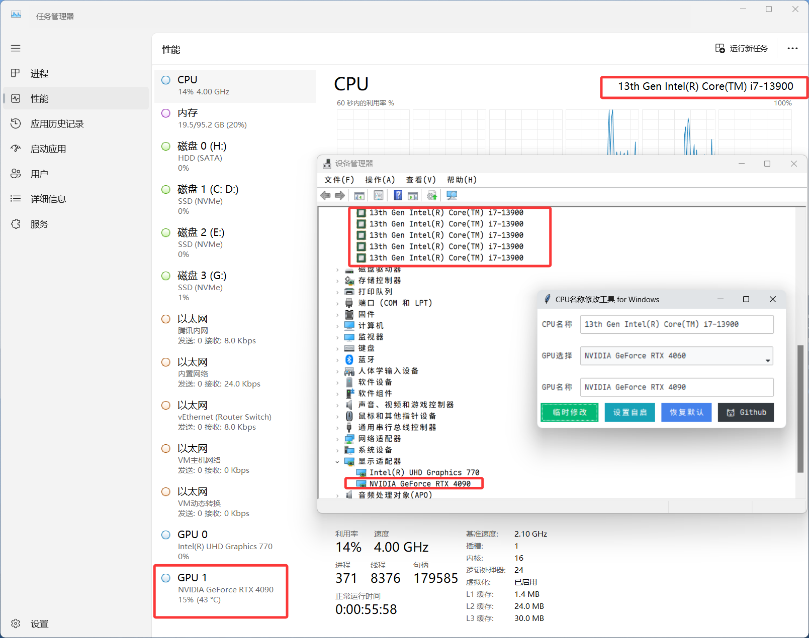

# Windows CPU名称修改工具 HwName
## Windows Hardware Name Modifier

## 工具介绍
本工具可以修改Windows上CPU显示名称，可以让ES/魔改 CPU显示正常的CPU型号而非`Intel 0000`

可以在任务管理器、设备管理器上显示修改的文本。本工具支持临时修改和开机免UAC自动修改型号

### 支持修改的地方：
 - 任务管理器中CPU名称
 - 设备管理器中CPU名称
 - 应用内获取的CPU名称

### 不支持修改地方：
 - 直接从CPU获取名称的APP
 - AIDA 64、CPU-Z、HWINFO

## 免责声明
 - 本工具仅用于自用PC修改ES CPU的显示名称
 - 不得用于任何商业行为或者欺骗性质的修改
 - 本作者不承担任何因修改带来的纠纷或后果
